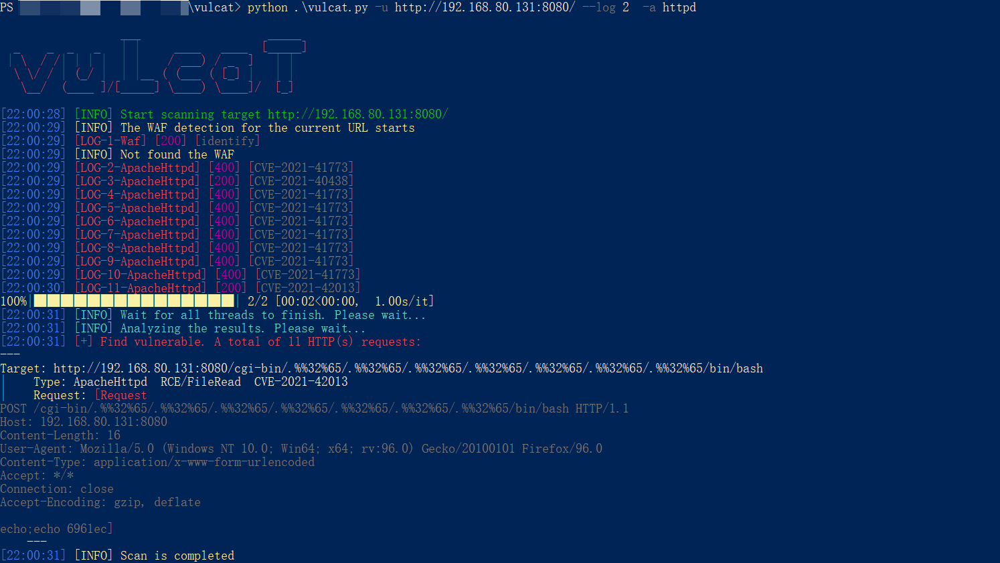
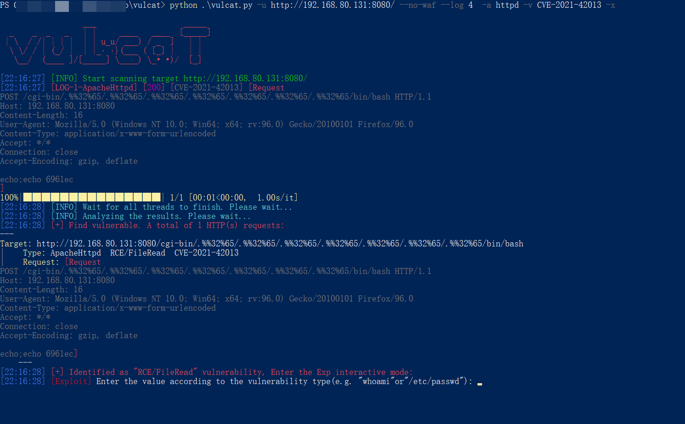
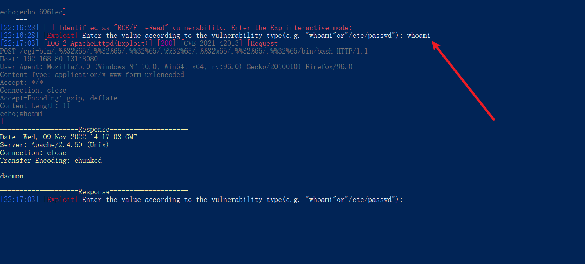
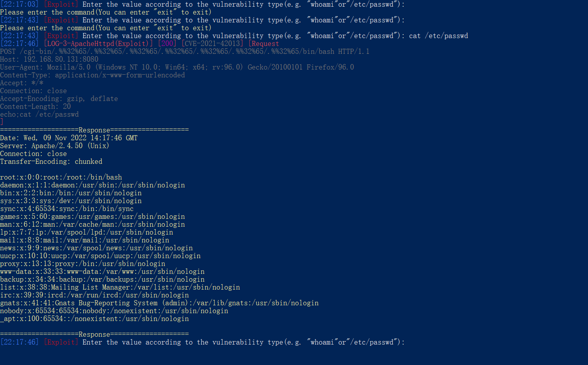
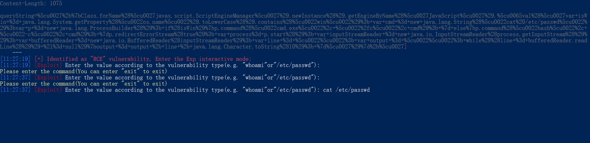
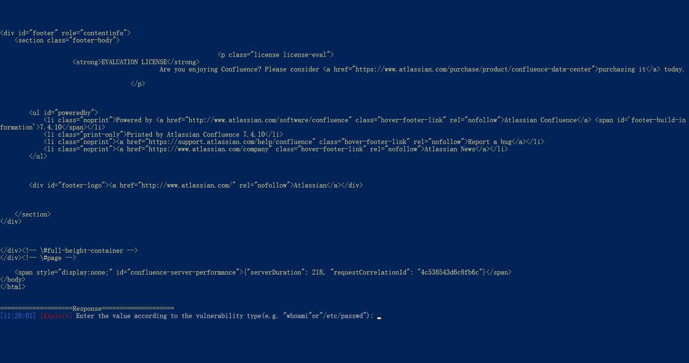
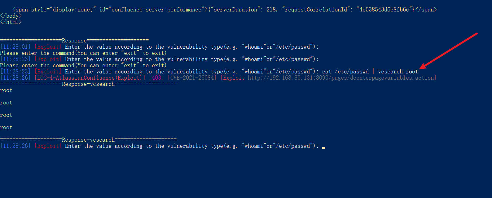
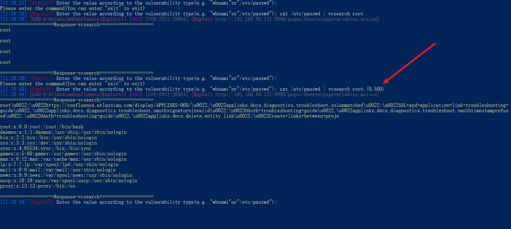
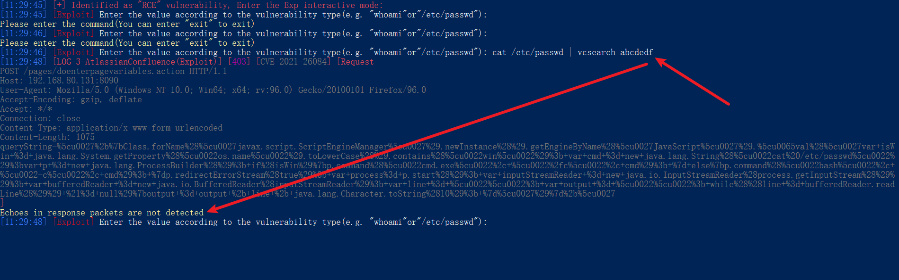
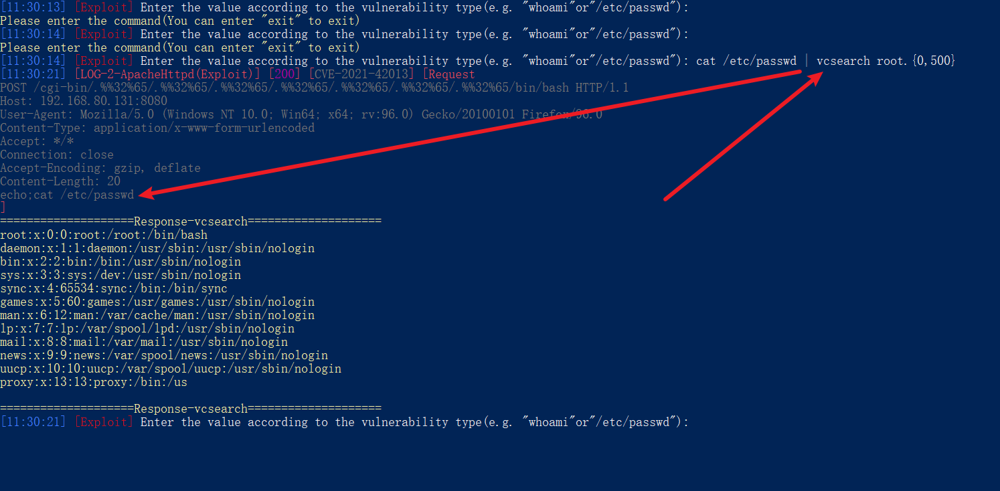

[中文版本(Chinese version)](README.zh-cn.md)

1. Scan for a vulnerability normally and exit after the scan is complete.

2. Enter exp interactive mode with -x/-- Exp (if this vuln exists)
    + The --log 4 parameter has also been added to make it easier to see what packets are being sent

3. Enter the "whoami" command. You can see that the following Response returns the execution result. Response is in the form of "Response Header + Response Content"

4. You can also try running other commands, such as cat /etc/passwd

# vcsearch

* introduce
    + vcsearch is a built-in feature of vulcat, similar to grep in linux
* use
    + Can be used to searches/filters for the specified content in Response
    + The search syntax is "regular expression"
        - your command | vcsearch Search for Content

* Pay attention to
    + vcsearch simply searches/filters the contents of the Response and is not sent out as part of the command

1. Take Confluence's CVE-2021-26084 vulnerability as an example

2. Enter the cat /etc/passwd command

3. After the operation, it is found that the response content is too much, and it is necessary to find the echo point of the command execution, and the experience is very poor

4. At this point you can use "| vcsearch content search" to search the contents of the Response
    + Search for "root" and "response-vcsearch" will list all matches in the Response package

5. vcsearch uses the syntax of regular expressions
    + root.{0,500} Search for root and the following 0-500 characters

6. If there is no matching search content, a message is displayed indicating that it was not detected

7. vcsearch does not affect the previous input and is performed separately

