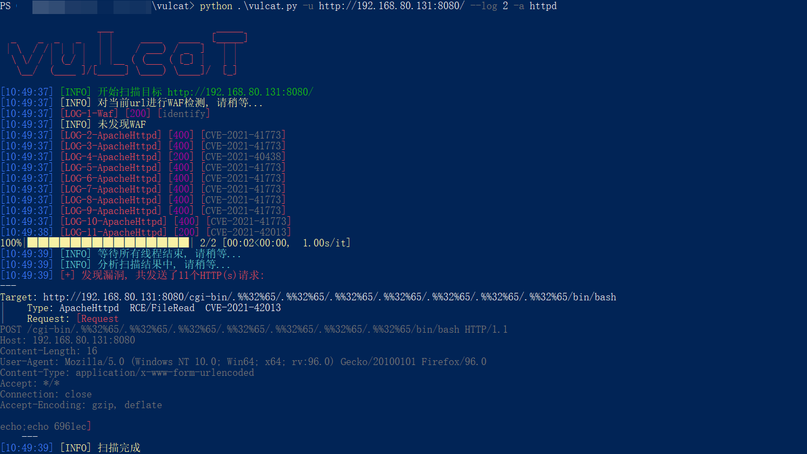
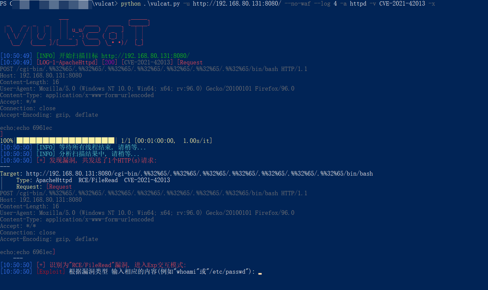
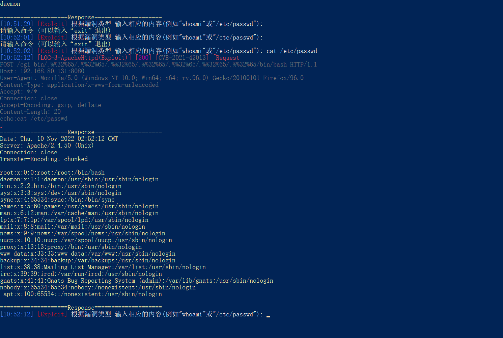
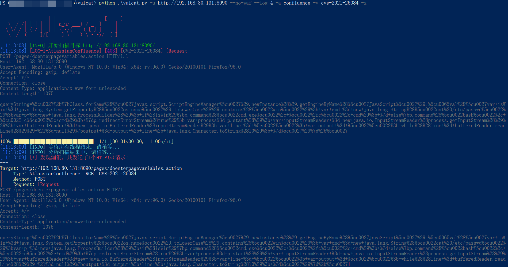
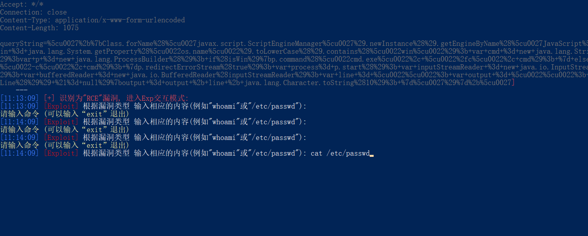
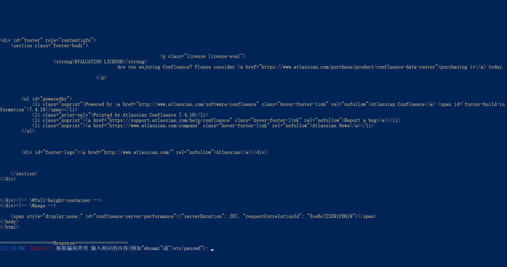
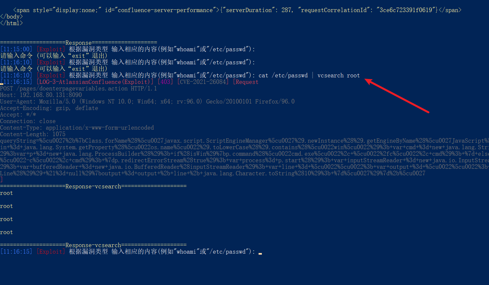
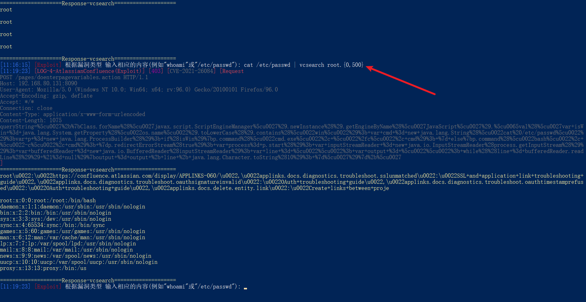
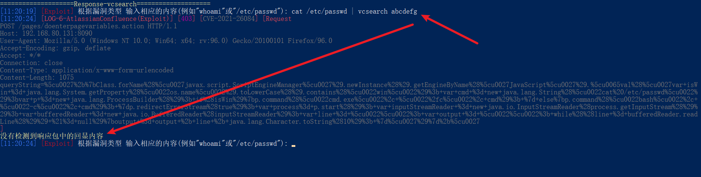
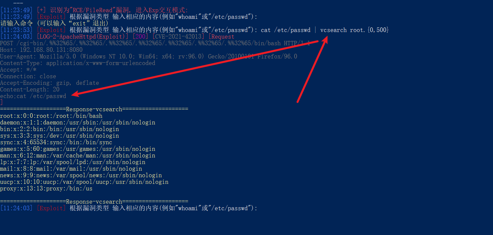

[English version(英文版本)](README.md)

# -x/--exp参数使用

1. 正常扫描一个漏洞, 扫描完成之后就会退出

2. 使用-x/--exp参数进入Exp交互模式 (如果这个漏洞存在的话)
    + 这里还添加了--log 4参数, 方便查看发送出去的数据包

3. 输入“whoami”命令, 可以看到下方的Response返回了执行结果, Response是“响应头+响应内容”的形式

4. 还可以尝试运行其他命令, 例如cat /etc/passwd

# vcsearch语法

* 介绍
    + vcsearch是vulcat自带的一个功能, 类似linux中的grep
* 使用
    + 可以用来搜索/过滤Response中的指定内容
    + 搜索语法为“正则表达式”
        - 你的命令 | vcsearch 搜索内容

* 注意
    + vcsearch只是搜索/过滤Response中的内容, 不会作为命令的一部分 而被发送出去

1. 以Confluence的CVE-2021-26084漏洞为示例

2. 输入cat /etc/passwd命令

3. 运行之后, 发现响应内容过多, 需要找命令执行回显点, 体验感极差

4. 此时可以使用" | vcsearch 搜索内容" 来搜索Response中的内容
    + 这里搜索"root", “Response-vcsearch”会列出响应包里面所有匹配的内容

5. vcsearch使用的是正则表达式的语法
    + root.{0,500} 是搜索root以及后面0-500个字符

6. 如果没有匹配的搜索的内容, 会提示没有检测到

7. vcsearch不会影响前面的输入, 而是另外执行

