[中文版本(Chinese version)](README.zh-cn.md)

# -o/--output

1. You can add the -o/--output parameter when scanning
    + It supports three values: html, json, txt
    + When you specify one of these values, for example -o txt
        - At the end of the scan, if vulnerabilities are found, the scan results are saved to a .txt file
        - If there are no vulnerabilities, the file is not generated

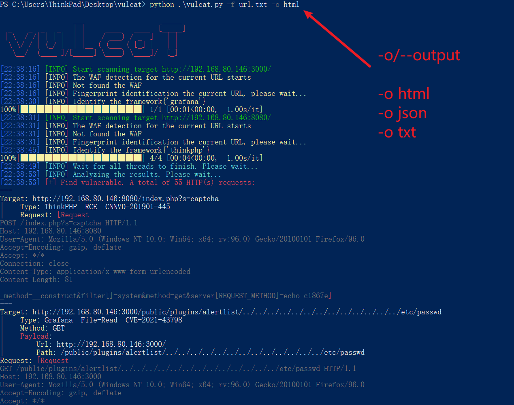
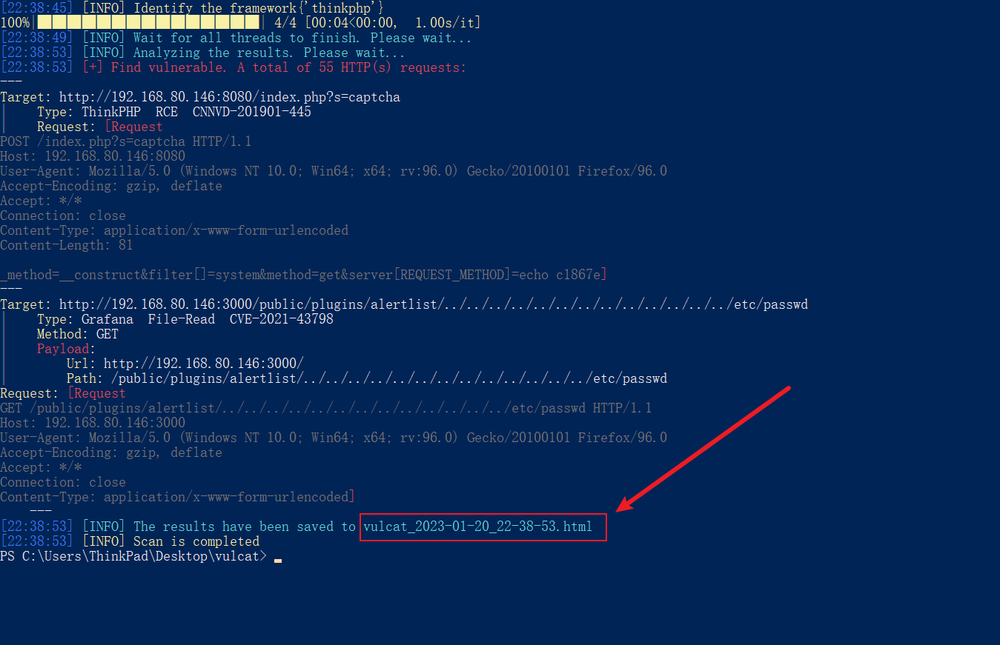
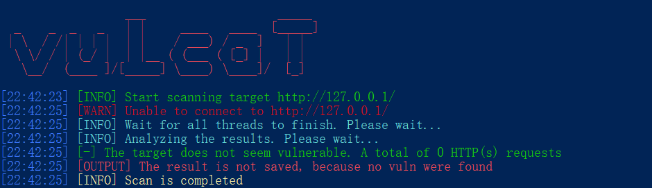

# .txt and .json reports
* The contents of the .txt and .json reports are consistent with what Vulcat outputs on the command line, and there is nothing special

# .html reports
1. The report is divided into four areas
    + Header
    + Content filter
    + Content display area
    + Footer

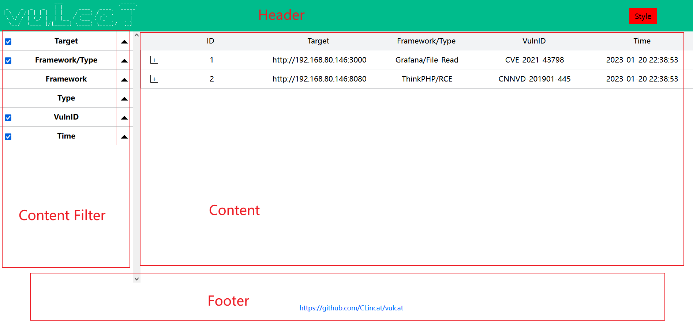

## .html-header
1. The top contains the LOGO on the left, and the "Style Switcher" on the right, you can move your mouse over the "Style" to see the list of styles

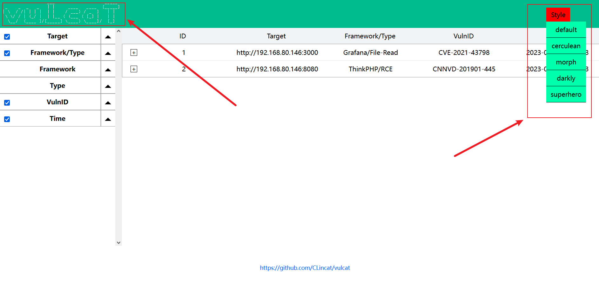

2. The default style is default, you can switch the style you want with a single mouse click (more styles, stay tuned)

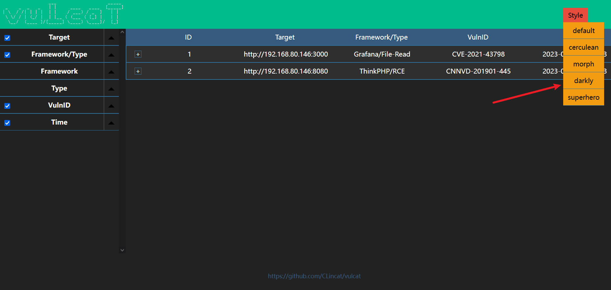

## .html-Content display area
1. You can "ascend or descend" the list by clicking on the title above
    + For example, click on the ID, and the content will be sorted according to the size of the ID (switching between ascending and descending)

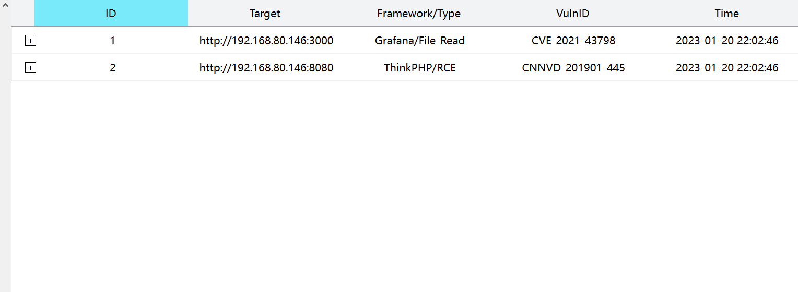
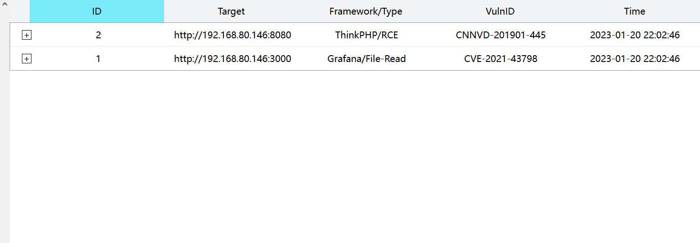

2. After clicking on one of the entries, the details are expanded
    + Full URL
    + HTTP request packets
        - You can copy the content below into the pasteboard by clicking the "Copy" button
        - Instead of manual selection

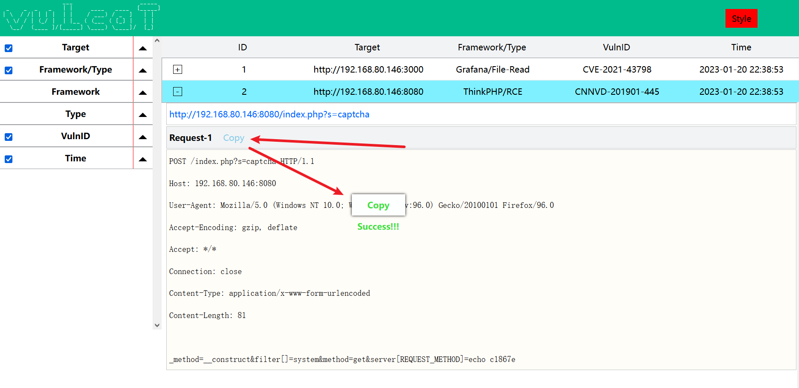

## .html-Content filters
1. (Header column) column content filtering, if you don't want to see a column content, you can click the header filter next to it to hide it
    + For example, hide Framework/Type and Time

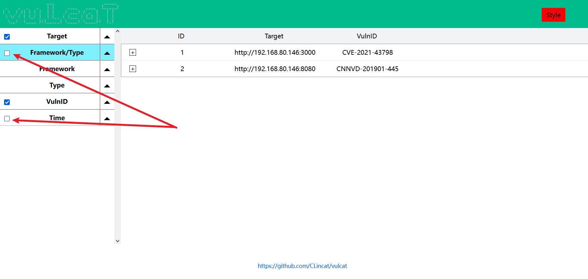

2. (Content row) row content filtering, if you don't want to see a row of content, you can click the "triangle" symbol next to the header filter, click it will display the row content filter
    + For example, you only want to view entries with vulnerability number CVE-2021-43798
    + Then drop down VulnID to hide other numbered entries, showing only CVE-2021-43798 entries

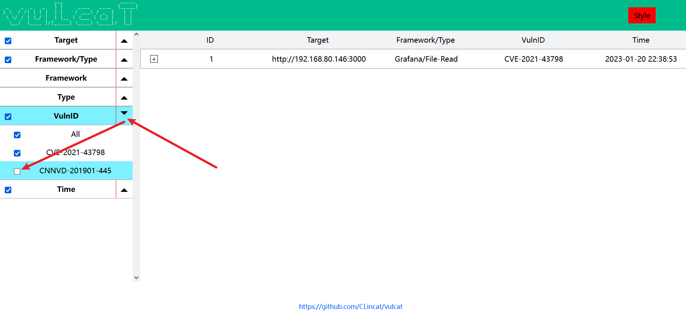

## .html-footer
1. This is the bottom (that's right, the introduction is that short)

