[English version(英文版本)](README.md)

# -o/--output参数使用

1. 你可以在扫描时加上-o/--output参数
    + 它支持三个值：html、json、txt
    + 当你指定其中一个值的时候，例如 -o txt
        - 扫描结束后，如果发现了漏洞，则会将扫描结果保存到.txt文件中
        - 如果没有漏洞，则不会生成该文件

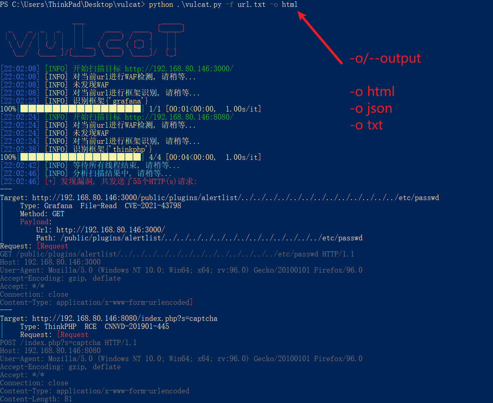
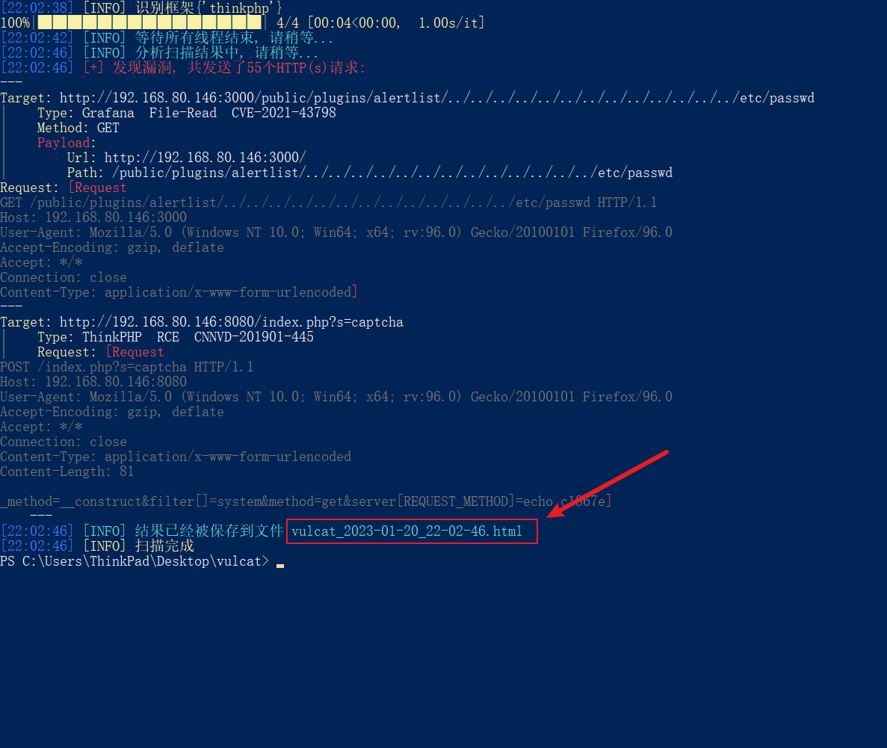
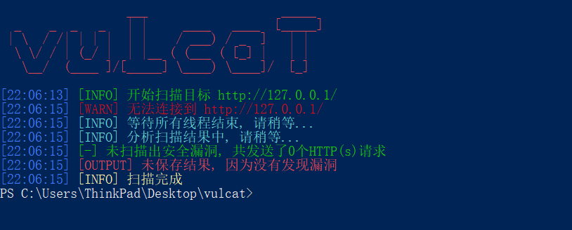

# .txt和.json报告
* .txt和.json的报告内容与vulcat在命令行输出的内容一致，没有什么特殊的

# .html报告
1. 报告分为4块区域，下面将逐一介绍
    + 顶部
    + 内容过滤器
    + 内容展示区
    + 底部

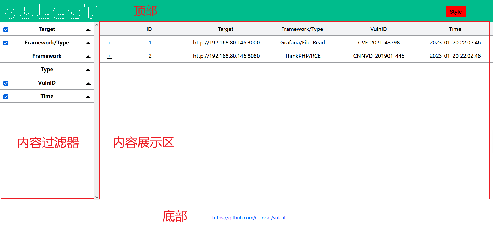

## .html报告-顶部
1. 顶部包含左侧的LOGO，和右侧的“样式切换器”，你可以将鼠标移动到“Style”上面，以查看样式列表

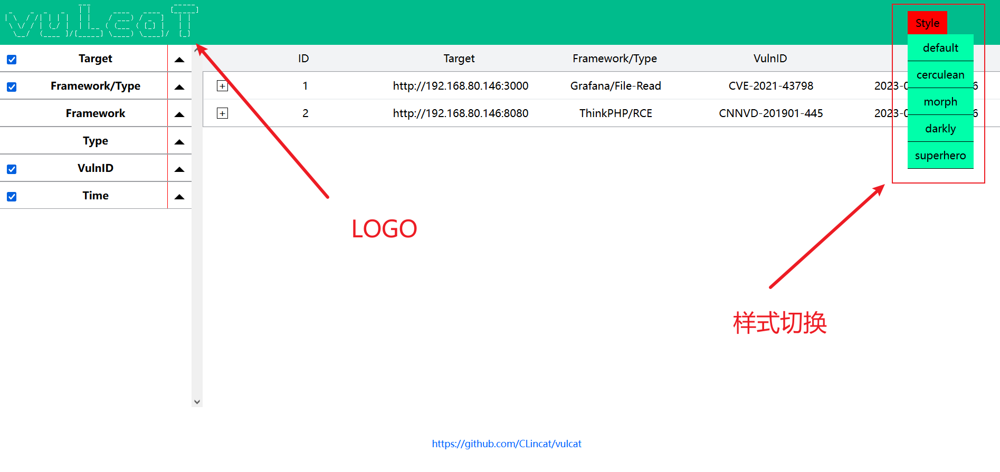

2. 默认样式为default，你可以通过单击鼠标，切换你想要的样式（更多样式，敬请期待）

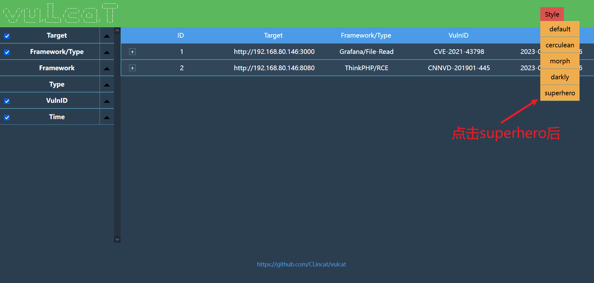

## .html报告-内容展示区
1. 你可以通过点击上方的标题，对列表进行“升序或降序”
    + 例如点击ID，则内容会根据ID的大小进行排序（会在升序和降序之间切换）

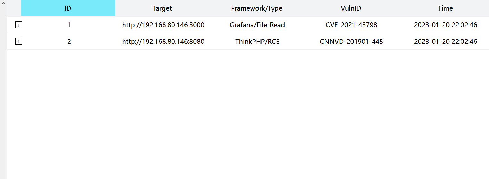
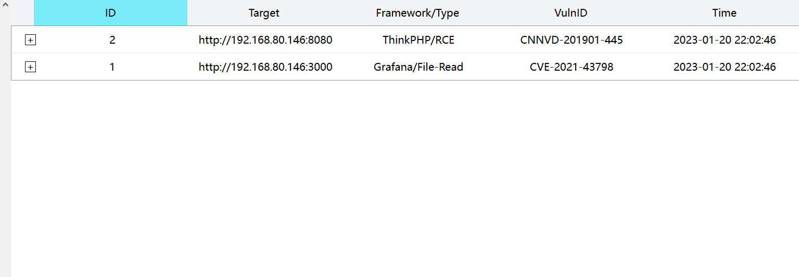

2. 点击其中一个条目后，将展开详细信息
    + 完整URL
    + HTTP请求数据包
        - 你可以通过点击“Copy”按钮，将下方的内容复制到粘贴板中
        - 而不用手动选择

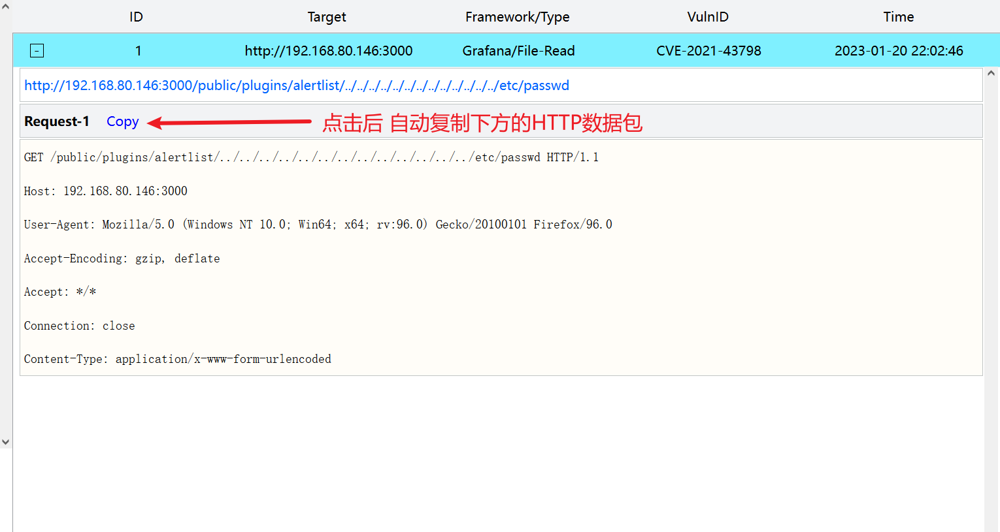

## .html报告-内容过滤器
1. （标题列）列内容过滤，如果你不想看到某列内容，可以通过点击旁边的标题过滤器，进行隐藏
    + 例如隐藏Framework/Type列 和 Time列

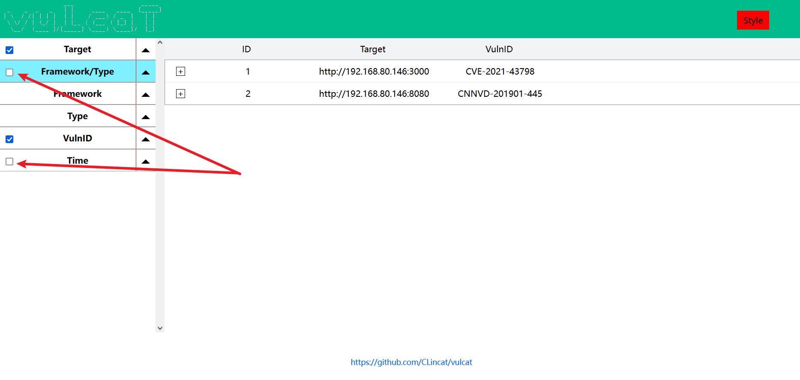

2. （内容行）行内容过滤，如果你不想看到某行内容，可以点击标题过滤器旁边的“三角形”符号，点击后会显示行内容过滤器
    + 例如只想查看漏洞编号为CVE-2021-43798的条目
    + 则下拉VulnID，将其它编号的条目隐藏，只显示CVE-2021-43798的条目

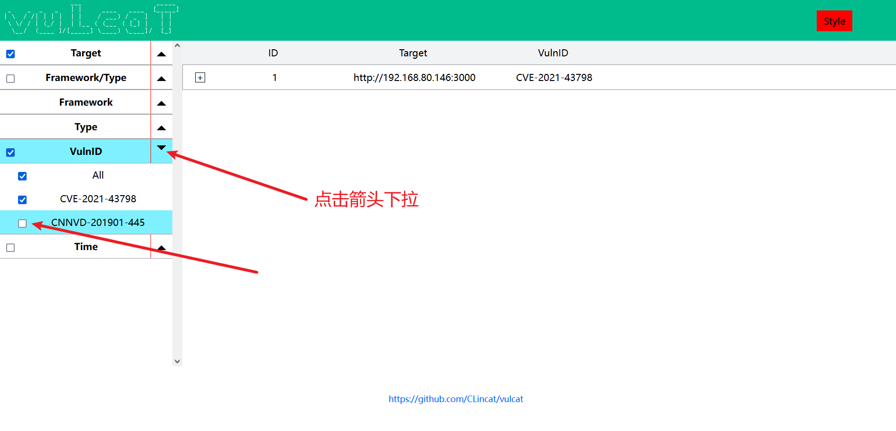

## .html报告-底部
1. 这是底部（没错，介绍就这么短）

