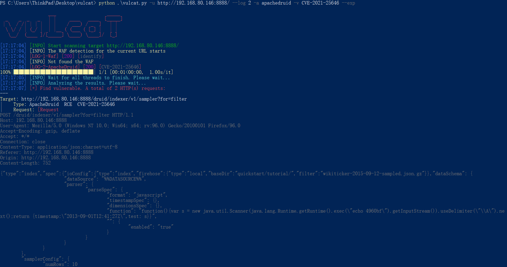
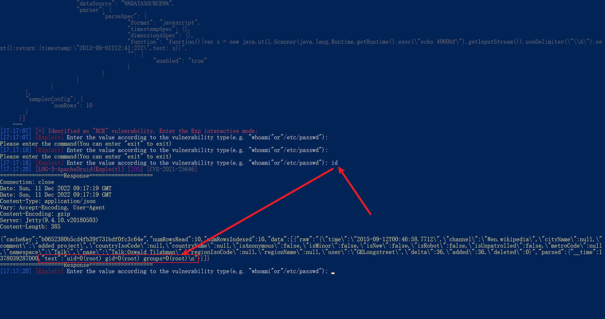
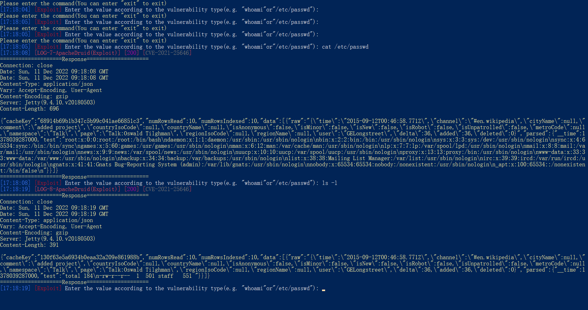
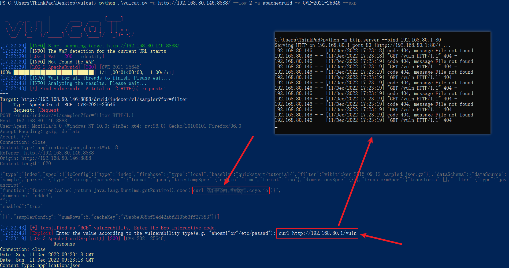

# Apache Druid 远程代码执行 (CVE-2021-25646)

* 运行环境
```
docker run -itd -p 8888:8888 vulfocus/apache_druid-cve_2021_25646
```

## 简介
Apache Druid 拥有执行用户提供的JavaScript的功能，嵌入在各种类型请求的代码中。
此功能在用于高信任度环境中, 默认已被禁用。
但是, 在 Druid 0.20.0及更低版本中, 经过身份验证的用户可以构造传入的json串来控制一些敏感的参数发送恶意请求, 利用Apache Druid执行任意代码

参考
* https://www.freebuf.com/vuls/263276.html
* https://cloud.tencent.com/developer/article/1797515

## vulcat
* 利用vulcat验证漏洞

### 1. 有回显
* 使用-x/--exp参数可以在扫描出漏洞时，进入EXP交互模式



* 输入id并回车，可以看到命令回显结果



* 回显存在一定缺陷，只能显示一行的内容，遇到换行\n时会丢失后面的内容



### 2. 无回显
* 如果回显POC无法使用，vulcat会尝试使用无回显的POC，无回显的POC使用**curl**或**ping**进行漏洞验证
* 同样可以使用-x/--exp参数进入EXP模式

