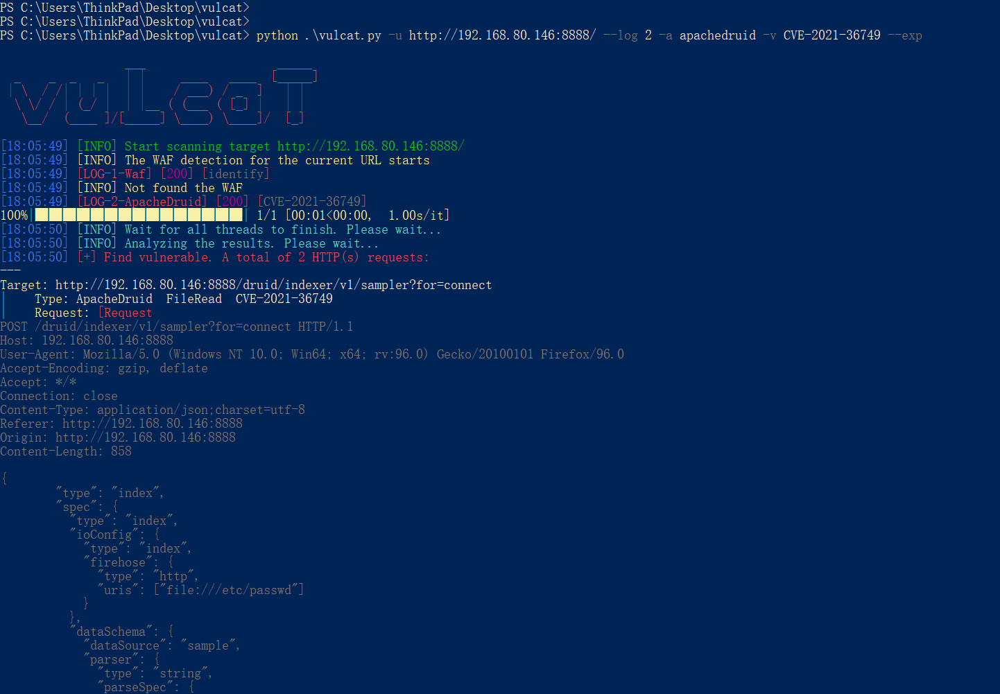
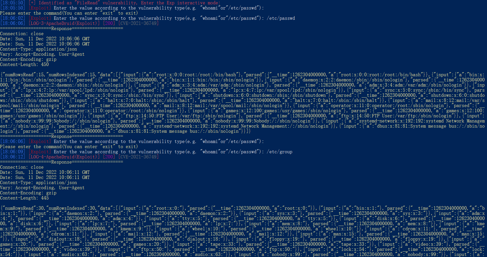
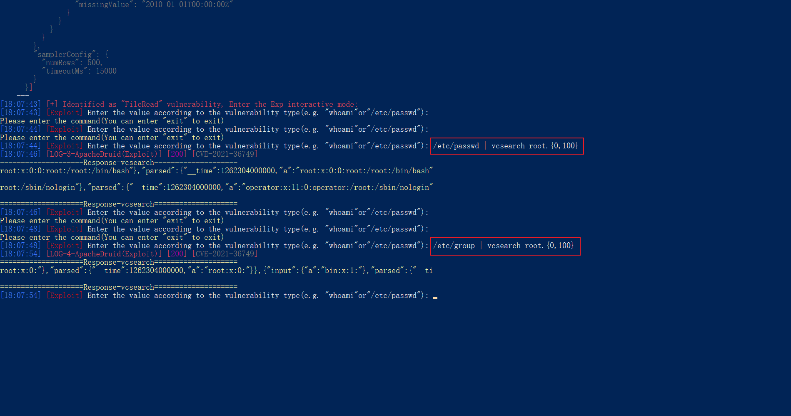

# Apache Druid任意文件读取 (CVE-2021-36749)

* 运行环境
```
docker run -itd -p 8888:8888 vulfocus/druid-cve_2021_36749
```

## 简介
Apache Druid对用户指定的HTTP InputSource没有做限制，并且Apache Druid默认管理页面是不需要认证即可访问的，因此未经授权的远程攻击者 可以通过构造恶意参数读取服务器上的任意文件

参考: https://cloud.tencent.com/developer/article/1942458

## vulcat
* 利用vulcat验证漏洞
* 该漏洞支持Exp模式
  


* 尝试读取/etc/passwd或/etc/group
  


* 可以使用vulcat自带的语法vcsearch对内容进行过滤，格式为正则表达式
  

