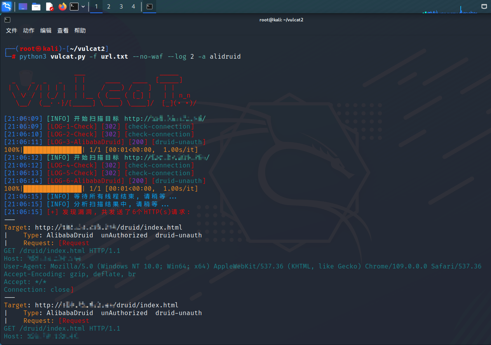
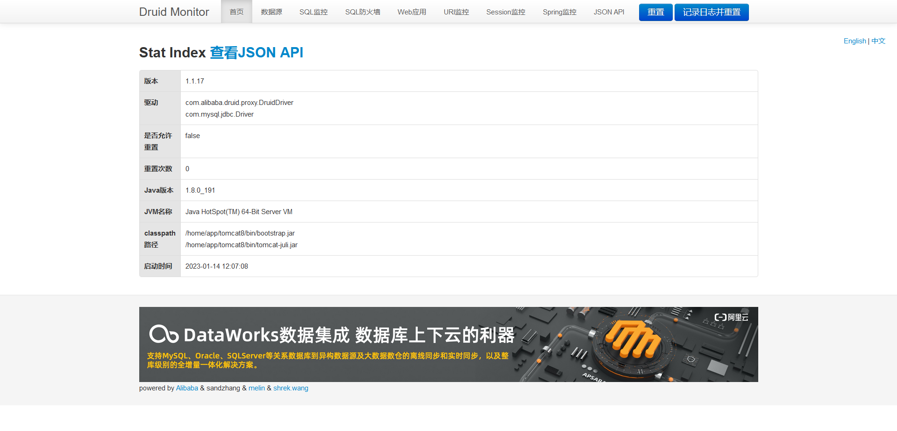

# 💛 Alibaba Druid-未授权访问

### 1）漏洞信息

| 漏洞名称                         | 漏洞编号 | 漏洞简介                                                                                                                               | 影响版本  | 修复建议                                                                                                                                                                                                                                                                              |
| ---------------------------- | ---- | ---------------------------------------------------------------------------------------------------------------------------------- | ----- | --------------------------------------------------------------------------------------------------------------------------------------------------------------------------------------------------------------------------------------------------------------------------------- |
| 
阿里巴巴Druid

未授权访问
 | 暂无   | 
    Druid是阿里巴巴数据库事业部出品，为监控而生的数据库连接池。

    Druid提供监控功能，监控SQL的执行时间、Web URI的请求、Session等。

    当开发者配置不当时就可能造成未授权访问漏洞。
 | ----- | <ol><li><a href="https://www.cxybb.com/article/qq_46119575/128542168">https://www.cxybb.com/article/qq_46119575/128542168</a></li><li><a href="https://blog.csdn.net/hawinlolo/article/details/125481204">https://blog.csdn.net/hawinlolo/article/details/125481204</a></li></ol> |

### 2）vulcat验证过程

<figure><figcaption></figcaption></figure>

<figure><figcaption></figcaption></figure>

### 3）参考链接：

[https://blog.csdn.net/a987212198/article/details/122600940](https://blog.csdn.net/a987212198/article/details/122600940)

[https://www.cnblogs.com/macter/p/16182880.html](https://www.cnblogs.com/macter/p/16182880.html)
