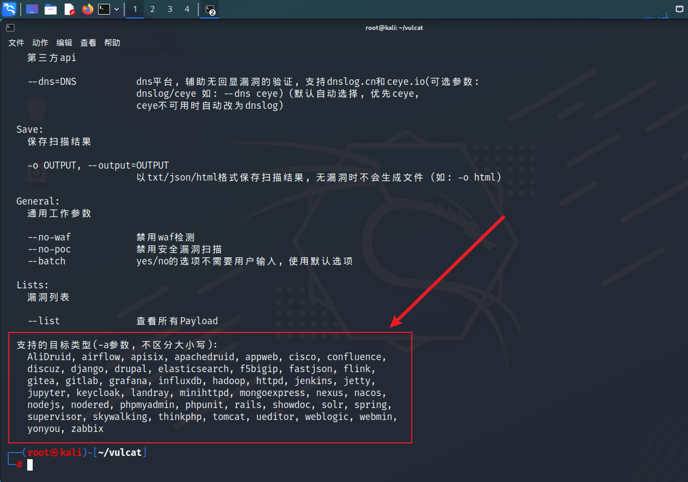
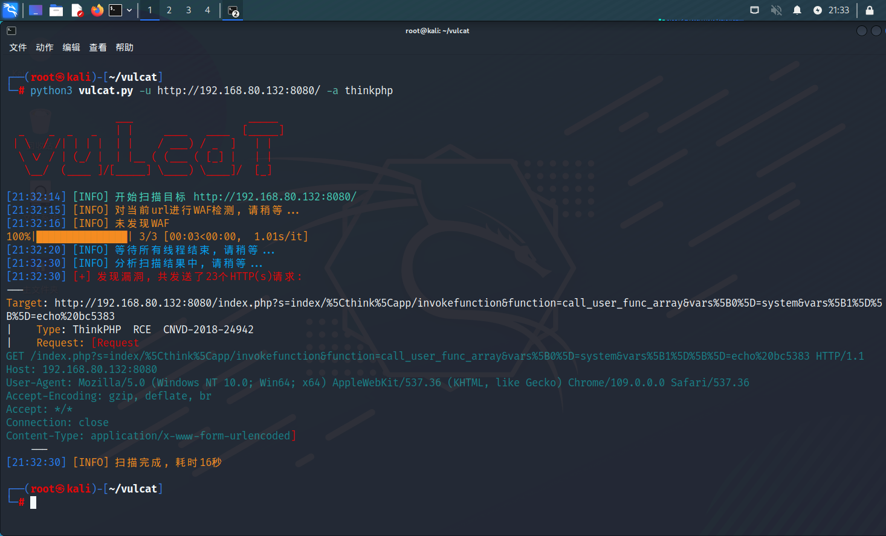
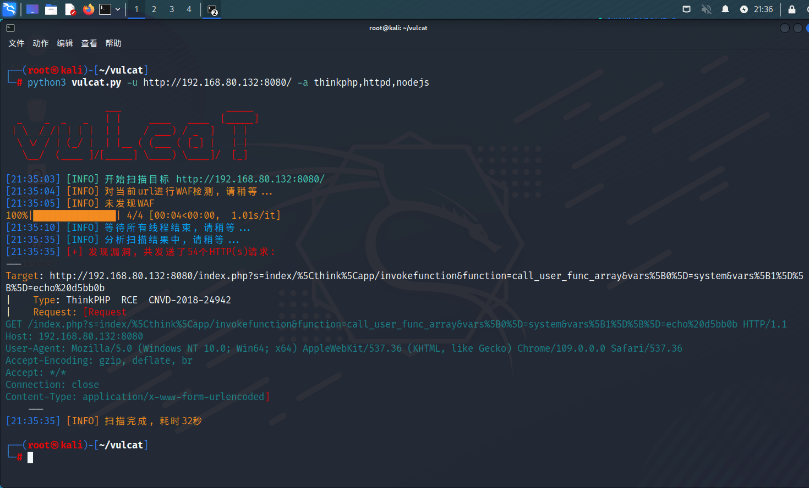
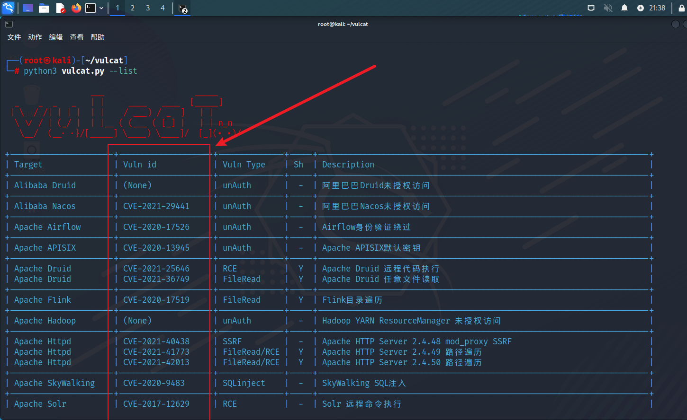

# 指定框架和POC

## -a/--application

如果你只想检测某个特定框架下的漏洞，或者想跳过指纹识别，可以使用该参数指定框架名称

```
python3 vulcat.py -u <URL> -a <NAME>
```

支持的框架名称 可以使用-h/--help选项，在最底部即可看到
<figure><figcaption></figcaption></figure>


如果只想检测ThinkPHP的漏洞：
```
python3 vulcat.py -u <URL> -a thinkphp
```

如图，直接跳过了指纹识别这一步骤，进行了ThinkPHP这一框架的漏洞检测
<figure><figcaption></figcaption></figure>

如果你想同时检测多个框架，可以使用逗号进行分隔：
```
python3 vulcat.py -u <URL> -a thinkphp,httpd,nodejs
```
<figure><figcaption></figcaption></figure>

## -v/--vuln

如果你只想检测单个漏洞，可以使用该参数指定漏洞编号

漏洞编号可以使用--list选项进行查看，没有编号的漏洞暂不支持
<figure><figcaption></figcaption></figure>

-v选项需要配合-a进行使用（指定框架名称+漏洞编号）
```
python3 vulcat.py -u http://192.168.80.132:8080/ -a thinkphp -v cnvd-2018-24942
```

<figure><figcaption></figcaption></figure>
