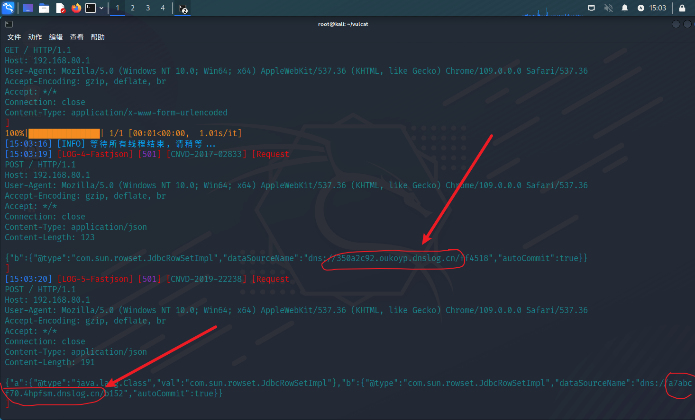
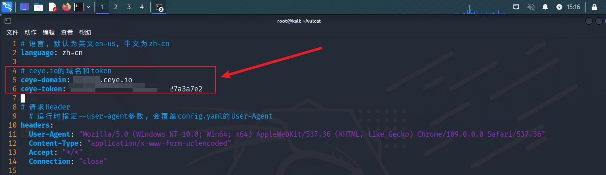
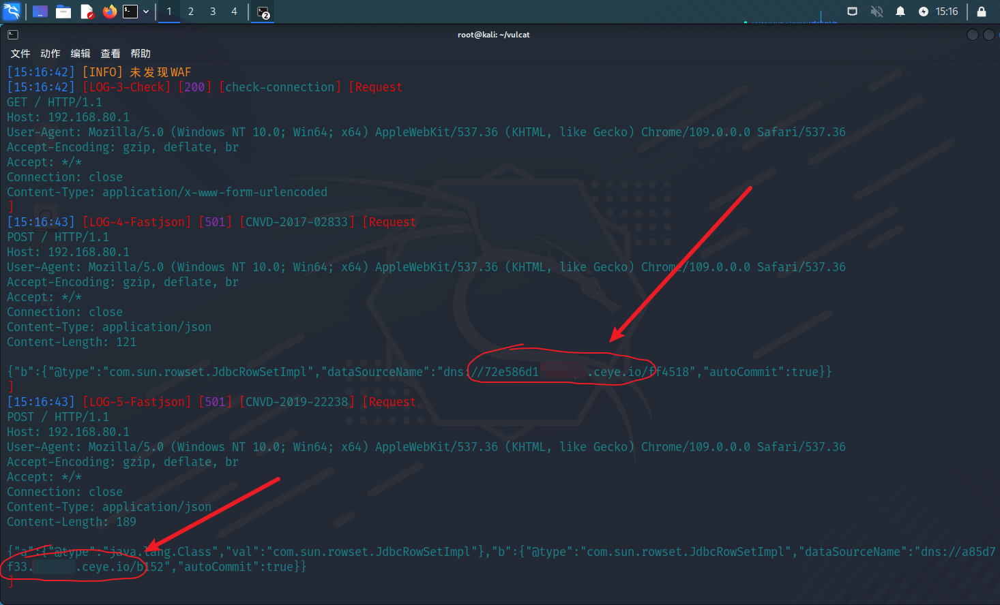

# DNSLOG平台

vulcat目前支持两个DNSLOG平台
* dnslog.cn
* ceye.io

## dnslog.cn

默认使用的就是 dnslog.cn
以fastjson漏洞为例，添加日志4级选项
```
python3 vulcat.py -u <URL> -a fastjson --log 4
```

找到fastjson的请求日志，可以看到数据包内使用的是 dnslog.cn

<figure><figcaption></figcaption></figure>

## ceye.io

<a href="../config/vulcat-config-ceye.html">点我查看ceye.io的配置方法</a>

将 域名和Token 写入config.yaml对应的位置，保存文件

<figure><figcaption></figcaption></figure>

运行扫描，vulcat会**自动切换**为 ceye.io
```
python3 vulcat.py -u <URL> -a fastjson --log 4
```

<figure><figcaption></figcaption></figure>

## --dns

**手动指定DNSLOG平台**

如果你填写了 ceye域名和Token，但是想改为使用 dnslog.cn或其它平台，可以手动指定

添加--dns选项，指定平台为 dnslog.cn
```
python3 vulcat.py -u <URL> -a fastjson --log 4 --dns dnslog
```

如果想指定平台为 ceye.io，则：
```
# 记得要在config.yaml添加 域名和Token，否则就算指定ceye也无法使用
python3 vulcat.py -u <URL> -a fastjson --log 4 --dns ceye
```
