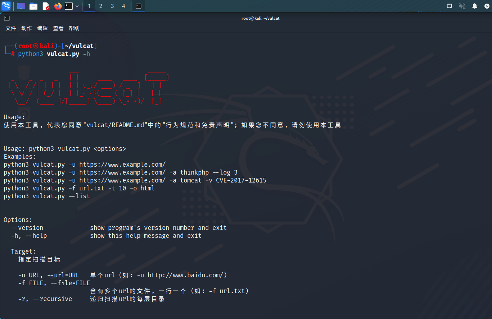
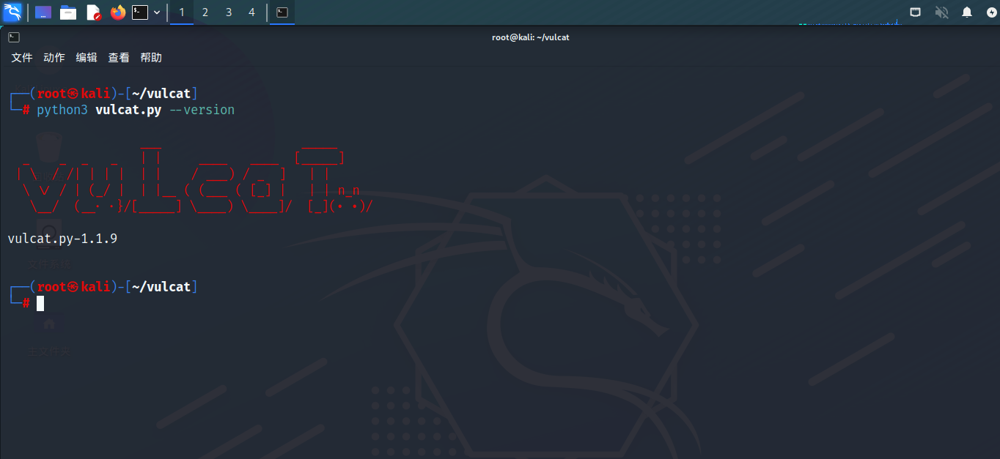
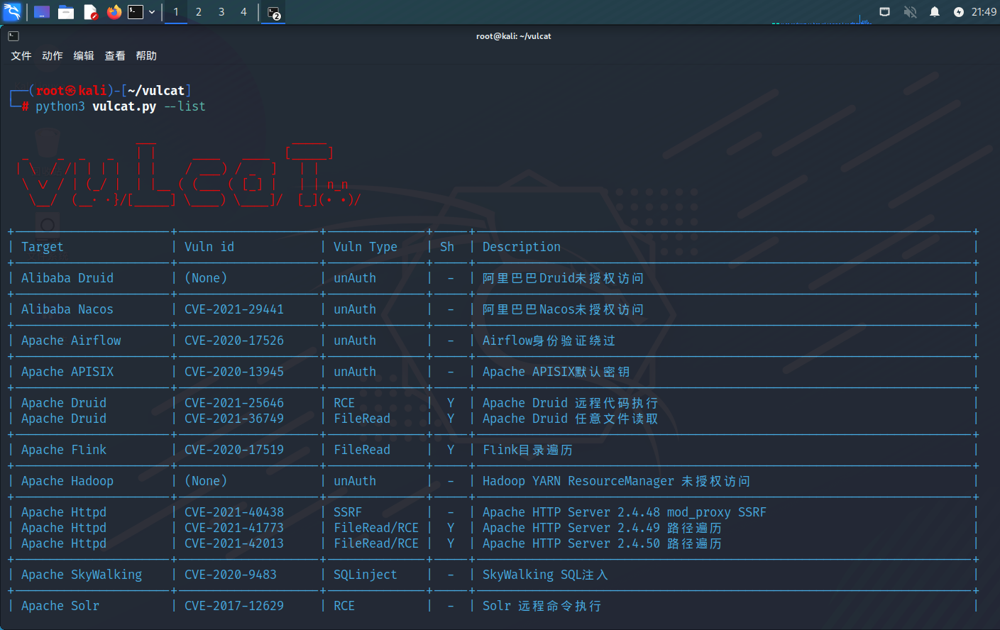
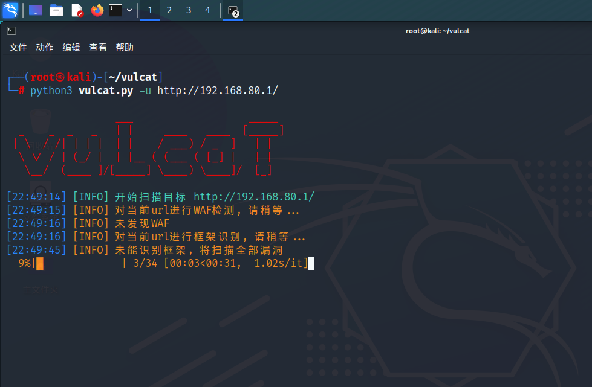
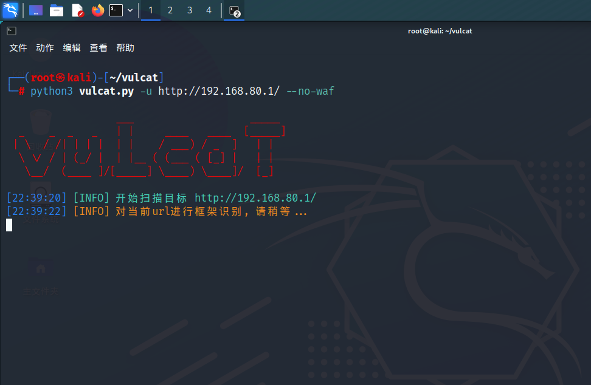
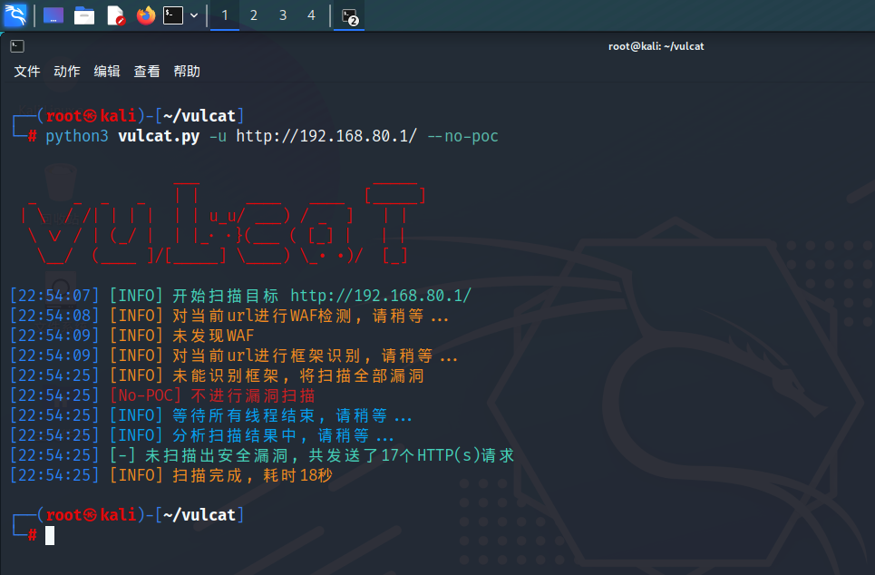
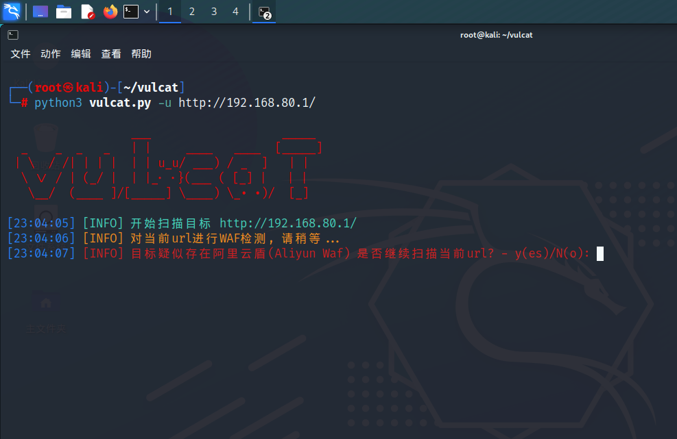
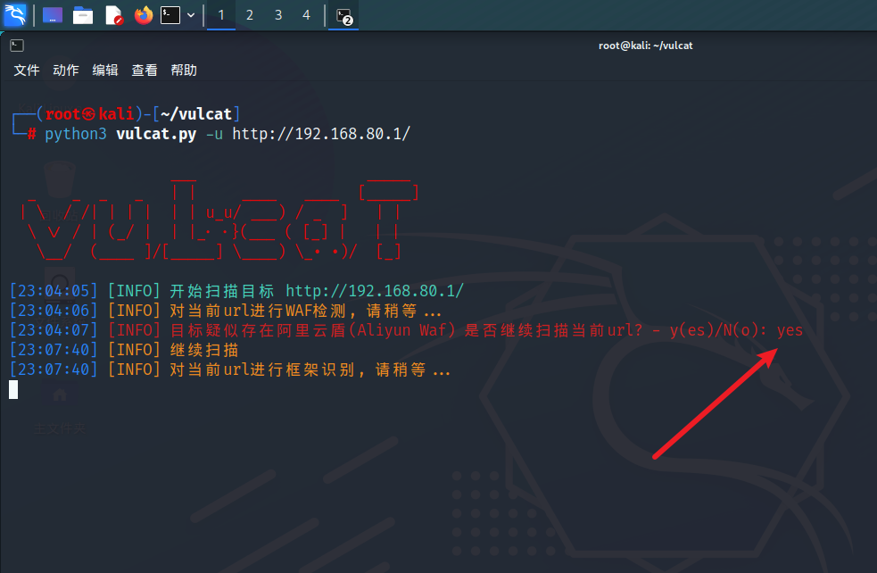
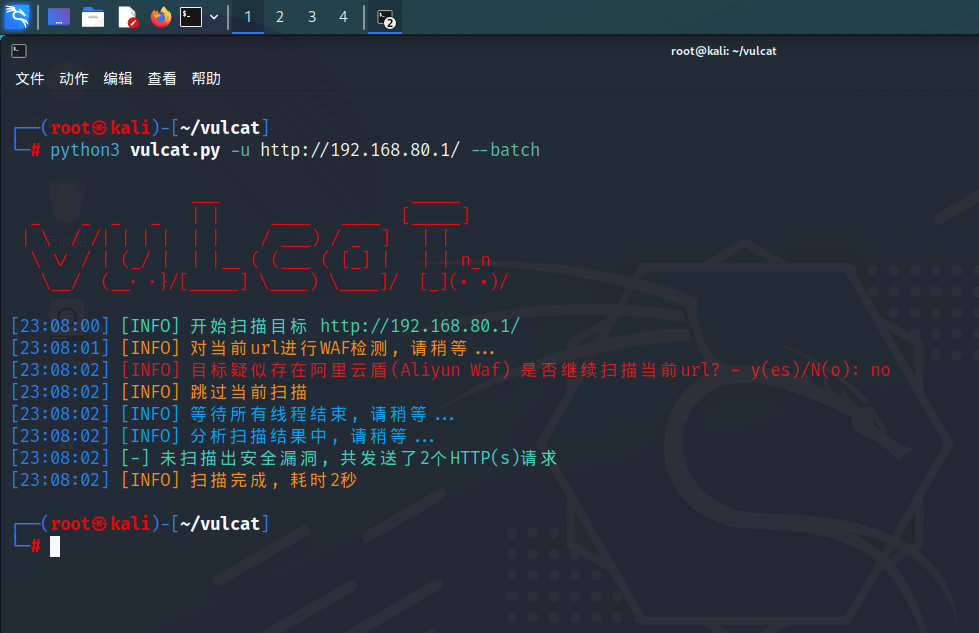

# 基本参数

## -h/--help

```
python3 vulcat.py -h
python3 vulcat.py --help
```

<figure>此参数用于查看帮助信息<figcaption></figcaption></figure>

## --version

```
python3 vulcat.py --version
```

<figure>此参数用于查看版本信息<figcaption></figcaption></figure>

## --list

```
python3 vulcat.py --list
```

POC列表 从左到右分别是：

* 应用名称
* 漏洞编号（None表示暂无编号）
* 漏洞类型
* 是否支持vulcat的Shell交互模式（Y表示支持）
* 漏洞描述

<figure><figcaption></figcaption></figure>

## --no-waf

添加此参数后，将跳过WAF检测

```
python3 vulcat.py -u http://192.168.80.1/ --no-waf
```

<figure><figcaption></figcaption></figure>

<figure>添加--no-waf参数之后，已经没有了WAF检测的提示（跳过了WAF检测）<figcaption></figcaption></figure>

## --no-poc

添加此参数后，将跳过POC检测

```
python3 vulcat.py -u http://192.168.80.1/ --no-poc
```

<figure><figcaption></figcaption></figure>

如图

<figure><figcaption></figcaption></figure>

## --batch

添加此参数后，当遇到需要手动输入的情况时，vulcat将自动使用默认参数值

例如WAF检测，如果检测到了WAF，则会跳出提示并要求用户输入

* 如果输入y或yes，则会继续进行 指纹识别和POC扫描等操作
* 如果输入n或no，则会跳过当前站点的扫描

<figure><figcaption></figcaption></figure>

<figure><figcaption></figcaption></figure>

从图中可以看到，No的N是大写的，而yes的y是小写的
* 通过大小写分辨默认选项，此处默认选项为No

```
python3 vulcat.py -u http://192.168.80.1/ --batch
```

当指定--batch参数时，vulcat会自动选择no，不需要用户手动输入

<figure><figcaption></figcaption></figure>


